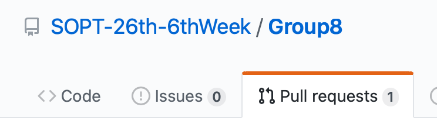

# Group8
##### 🤓 깃초보 예슬이가 알려주는 깃 사용법

- 관리자시점 : 

  - 초기 setting이 필요해요!

    1. Git Repository를 생성해주세요. (자세한건 아팟장님의 ios git bash 참조)

    2. Git Repository를 로컬에 클론해주세요.  

    <code>git clone [ 주소 ]</code>

    3. Xcode에서 프로젝트를 만들어주세요.

    4. 필요에 따라 폴더링, pod init, podfile 수정, pod install, info.plist 수정, **Assets 다운**, **.gitignore 설정** 등등.. 초기 셋팅을 모두 마치고 push 해주세요! 이후에 같은 파일을 둘 다 수정하면 충돌나는거예여 주의주의‼️

       .gitignore란: 저장소에 업로드하지 않을 파일의 규칙을 정의하는 파일

       터미널 내 깃 로컬에서 <code>touch .gitignore</code>

       그럼 로컬에 빈 .gitignore 파일이 생기쥬?

       [gitignore.io 접속](https://www.toptal.com/developers/gitignore) → 아래와 같이 원하는 키워드를 넣어주고 생성을 누릅니당.

       만약에 여기 키워드에 cocoapods 을 추가한다? 그러면 푸쉬할때 pod 빼고 올라가고 그렁거예요.
       
       			
           
       
       생성된 코드를 아까 만든 .gitignore 파일 내용으로 복붙해주고 저장하면 끄읏~ 저는 vi에디터가 불편하기 때문에 파인더에서 그냥 텍스트편집기로 해요. 편할대로 하심 댑니다~!
  
  - 팀원이 브랜치도 파고~ 플젝이 한창 진행중일 때~ 각자의 브랜치에서 push하면 master 브랜치에서 merge 해주면됩니당 master는 master에서 뻗어나간 각각의 브랜치에서 작업한 내용을 다시 하나씩 갖다 붙이는 곳이라고 생각하믄 되어요.

    1. 레포 원격저장소로 갑니다!

​				2. yeseullee 브랜치에서 푸쉬를 했다 ! 보이시죠? Compare & pull request 눌러주세영~

   - Base: master <- Compare: yeseullee

     Yeseullee 브랜치에서 변경된 내용을 master 브랜치로 머지하고 싶어요~ 이 뜻이에요.

   - ​	Able to merge.

     > 충돌 없이 잘 머지될거란 뜻입니당.  그럼 충돌이 나면 어떡하죠⁉️ 

   자 그럼 create pull request 눌러주세요!

 🔼 그럼 이렇게 pull requests에 1! 뜬 거 보이시쥬? 아주 좋아요👍

 🔽 Pull requests를 눌러보면 이렇게 날아온 PR이 뜹니당. Merge pull request 해주면 마스터에 머지 끄읏~

   또 한가지!! 만약 내 브랜치와 마스터 브랜치의 내용이 다를경우!! 마스터의 내용을 내 브랜치로 받아오고 싶다!!

   그럼 일단 내 브랜치로 이동~

   🔼 This branch is 1 commit behind master. 보이시져? 그리고 오른쪽에 pull request, compare 아무거나 눌러바여~

   오잉? 비교할게 없다고 뜨져?! 여기서 그럼 base랑 compare를 서로 바꿔볼게요

   그럼 이렇게! 또 pr을 생성할 수 있게 뜹니당 똑같이 pr 날리고 merge 해주면 끝~

   이걸 원격이 아닌 로컬에서 터미널로 하고싶다❓

   어떻게 해야할까요? 

1. yeseullee: git push 👉  일단 내 브랜치에서 뭔가 푸시한다~

2. yeseullee: git checkout master 👉  마스터 브랜치로 이동한다~ 

3. master: git pull origin master 👉  마스터의 로컬 내용이 원격 저장소와 다르다면 pull 받는다~

4. master: git merge yeseullee 👉  마스터브랜치에서 예슬 브랜치 내용을 머지한다~
5. master: git push 👉  원격에 로컬에서 변경된 내용을 푸시해준다~

   이와 같은 방법으로 내 브랜치에 업데이트된 마스터 브랜치(master -> mybranch)를 가져와서 머지하고 싶다면,

   일단 자기 브랜치에서 하던 작업을 모두 꼭! commit 해주세요! 

   master 브랜치에서 git pull origin master 해서 마스터 브랜치 내용을 받아온 다음,

1. master: git checkout yeseullee 👉예슬 브랜치로 간다~

2. yeseullee: git merge master 👉 내 브랜치와 마스터 브랜치를 머지해준다~

   똑같이 원격에 푸시해준다~~

   너무 쉽죠??? ㅋㅋㅋㅋ (?)

> 충돌이 나도 해결할 수 있숴요. 고것은 2편에서 투비컨티뉴....

​       
